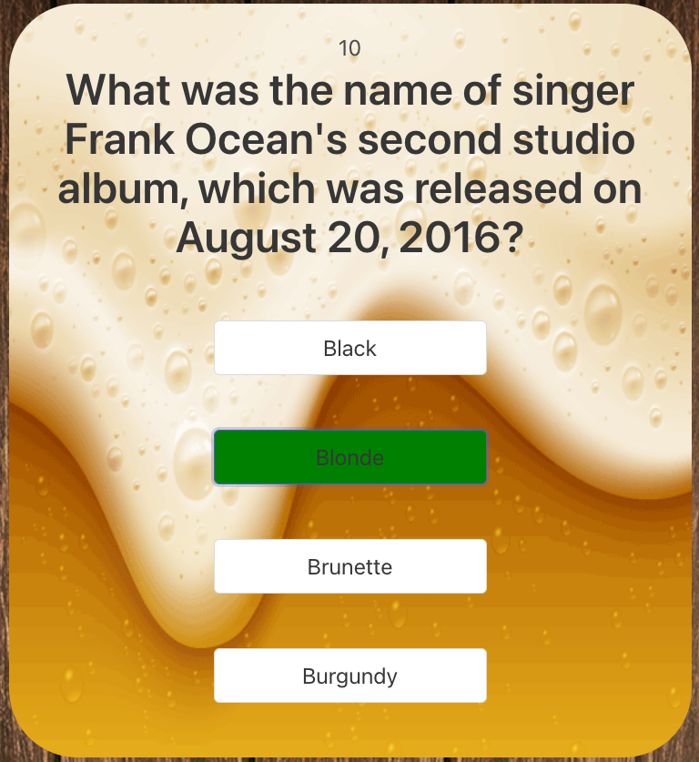
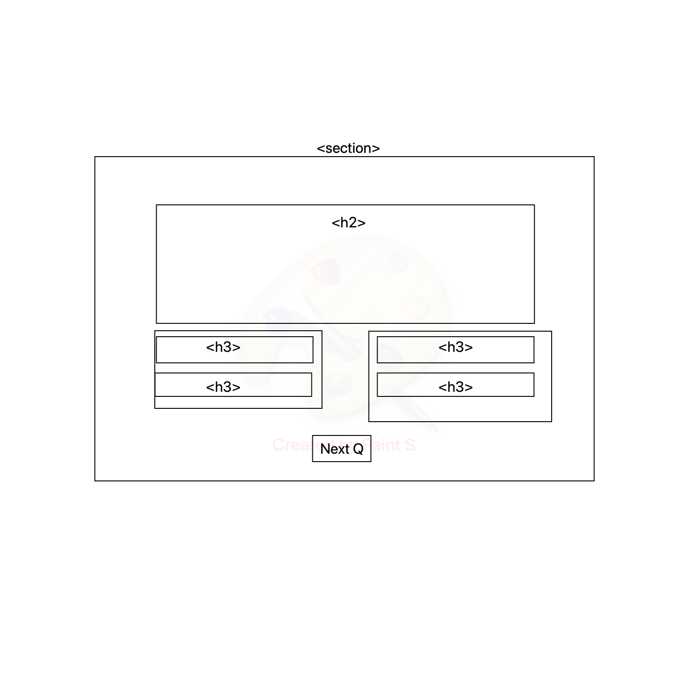

# React Pub Trivia Quiz Generator App

## Overview

This was a pair-programming hackathon over 48 hours built with React, CSS, Bulma, Quiz Trivia API. We used the [Open Trivia Database API](https://opentdb.com/api_config.php) to access trivia questions and multiple answers and display it on a React frontend.

## Brief

The brief was to build a React app that consumes a public API, the only constraint was it was to be done under ‘Hackathon’ conditions over 48 hours.

## Members

[Kyle Eggelhoefer](https://github.com/kyle-egg)

## Deployment

The app has been deployed with Netlify and is available here.

## Getting started

Access the source code via the 'clone or download' button.
`npm install` - Install dependencies.
`npm run dev` - Run the app in development mode.

## Technologies used
- HTML 5
- SCSS
- JavaScript
- React.js
- Open Trivia API
- Axios
- react-router-dom
- Bulma CSS Framework

## Demonstration/cover image


## Process
The first thing we did was to research free APIs on the internet, bearing in mind the time constraints we also had to determine whether API keys were required and if so how long it would take to access them. We eventually settled on the OpenDB Trivia API which is a free to use, user-contributed trivia question database containing over 4,000 verified questions. 

After hooking into the API with the REST Client for VS Code extension to inspect the dataset, we settled on the idea of building a pub trivia quiz generator that extracts questions and multiple choice answers from the dataset.

We then took the following steps:

- Created the app’s wireframes. 

- Creating the necessary components in React: Home, Quiz and QuizCard.
- Creating the quiz flow and game logic.
- Styling with Bulma and SCSS.

### Data
The raw data that the API returned was in an encoded format as some of the questions contained Unicode or Special Characters. This meant that before doing anything else the data had to be decoded. 

> **Example Sentence (Non Encoded)**: "Don't forget that π = 3.14 & doesn't equal 3."

> **Default encoding (HTML codes)**: Don&‌#039;t forget that &‌pi; = 3.14 &‌amp; doesn&‌#039;t equal 3.

We wrote a function that took a string as an argument and set it as the innerHTML property of a created textarea element. 

```javascript
function decodeData(str) {
    const dataCleaner = document.createElement('textarea')
    dataCleaner.innerHTML = str
    return dataCleaner.value
  }
```
The data returned from the Get request was then wrapped in this decoding function to remove any ASCII characters. The structure of the returned data was also difficult to work with e.g. each returned object had a key of correct_answer for the actual answer and an incorrect_answer array that had to be combined and randomised. We did this by creating a new array, spreading the incorrect_answer into this, including the correct_answer and then applying a sort method to this array. We also devised a work around for the lack of a suitable id for each object by taking the index number and attaching a timestamp using the now method of the date object.

```javascript
const getData = async () => {
      const response = await getQuizData() 
      const rawData = response.data.results
      const refData = rawData.map((item, index) => {
        const answer = decodeData(item.correct_answer)
        const options = [ 
          ...item.incorrect_answers.map(answer => decodeData(answer)), 
          answer
        ]
        return {
          id: `${index}-${Date.now()}`,
          questions: decodeData(item.question),
          answer: answer,
          options: options.sort(),
        }
      })
      setData(refData)
    }
```

### Quiz Logic
We set up logic to check whether the selected answer was the correct or wrong answer using an if statement that checked if the correct answer was included in the textContent of the user's selection. 

```javascript
const handleAnswer = (e) => {
    const correctAns = data.map(ans => (ans.answer))
    if (correctAns.includes(e.target.textContent)) {
      console.log(score)
      setScore(score + 10)
      e.target.classList.add('correct')
    } else {
      setScore(score - 5)
      e.target.classList.add('incorrect')
    }
  }
```

## Challenges
Building my first React app from scratch did prove to be extremely challenging and in hindsight one that required large amounts of logic and state changes probably wasn’t the best choice for a hackathon. Never-the-less it provided ample learning opportunities and increased my understanding of the problems React was designed to solve e.g. our first iteration of the app pulled a single question and used server side rendering to get further questions, which defeated the object of a single page app (SPA). We then refactored our code to create a more SPA like experience, unfortunately time constraints meant that we didn’t really get to flesh this iteration out fully.

Working out the nature of state changes and also the sheer number of things that needed to be put in state to get the app to function as hoped took up a good amount of our time. However the issue that unexpectedly took up an unreasonably large proportion of our time was the data decoding process. We initially started the process with Base64 encoded data as there is a browser based method, atob(), for decoding data. When this turned out to be insufficient for our needs we switched to an avalanche of if statements, which again proved insufficient. After a great deal of research we stumbled upon our final solution (detailed above), which we modified for our purposes.

## Wins
A major benefit of pair-coding was having someone else to bounce ideas off and also learning to use the VSCode Liveshare functionality.

Being able to code the quiz logic fairly easily was a real source of pride and highlighted that my fundamentals were strong.
 
## Future features
Under less time constrained conditions the whole code base would benefit from a good deal of refactoring to make it more reactive and to enhance the user experience. The quiz itself could be fleshed out with more question types e.g. true/false booleans.

## Key learnings
This project was a huge boost to my knowledge of the nature of and how to leverage API endpoints effectively. 

It was also my first experience of pair programming, which helped immensely with my technical communication skills as this was done remotely.

